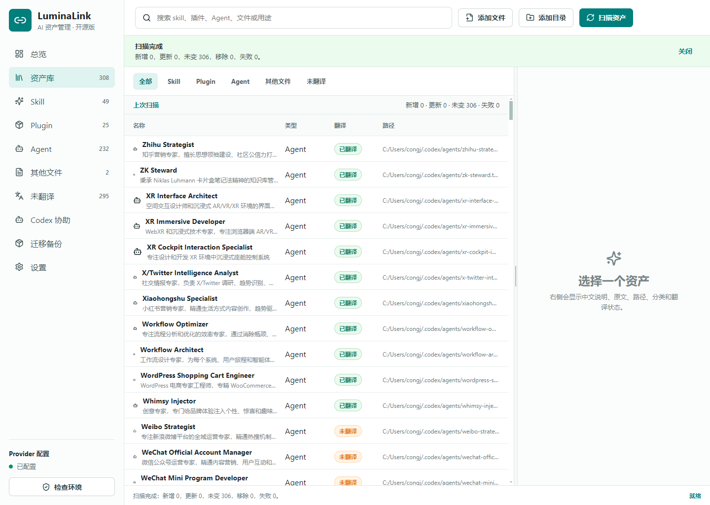
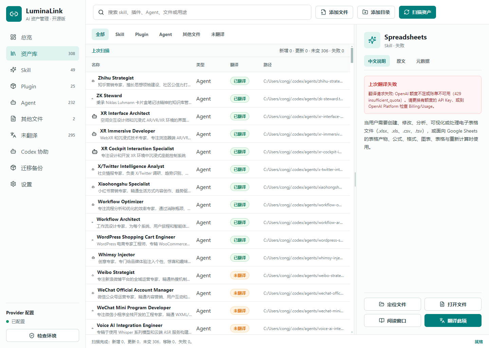
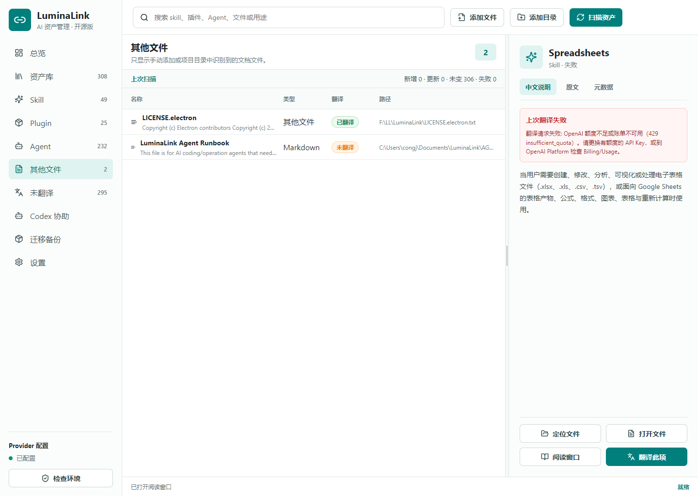
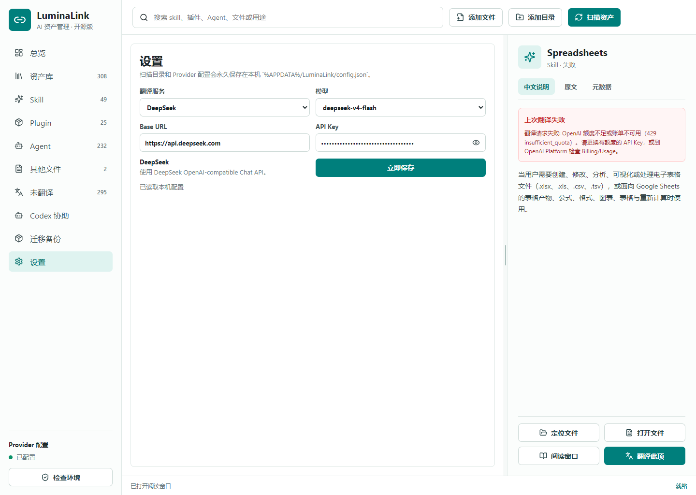

# LuminaLink

> 中文优先的本机 AI 资产管理桌面端。

LuminaLink 用来集中管理电脑上的 Codex / Agent 资产：Skill、插件、Agent 指令文件、项目文档和中文翻译缓存。它不修改原始文件，只做扫描、索引、翻译缓存和阅读增强。

<p>
  <a href="https://github.com/1135572798/LuminaLink/releases"></a>
  
  
</p>



## 适合谁

- 本机装了很多 Codex skills、插件或 Agent 配置的人。
- 想把英文说明默认翻译成中文，后续长期查看的人。
- 想让 Codex 直接读取本机操作手册，帮忙扫描、翻译、迁移配置的人。
- 经常换电脑，希望资产索引和非敏感配置可迁移的人。

## 核心功能

- **资产扫描**：扫描本机 Skill、Plugin、Agent、Markdown / 文本文档。
- **中文阅读**：中文说明优先展示，支持原文和元数据切换。
- **翻译缓存**：翻译结果写入本地 SQLite，后续直接复用。
- **阅读窗口**：长译文可独立窗口查看，右侧详情栏也可拖拽调宽。
- **实时翻译**：支持 OpenAI / DeepSeek / OpenAI-compatible 的流式翻译进度。
- **Codex 协助**：生成本机 Agent 操作手册和 helper，方便让 Codex 代操作。
- **迁移备份**：导出非敏感配置和翻译缓存；不会导出 raw API key / token / cookie / 私钥。

## 界面预览

| 资产详情与阅读窗口 | Provider 设置 |
| --- | --- |
|  |  |

| Codex 协助 |
| --- |
|  |

## 下载使用

普通用户请直接到 [Releases](https://github.com/1135572798/LuminaLink/releases) 下载：

- `LuminaLink-Setup-1.0.0-x64.exe`：安装版
- `LuminaLink-Portable-1.0.0-x64.exe`：免安装版

首次打开后：

1. 点击 **扫描资产**。
2. 在左侧选择 `Skill`、`Plugin`、`Agent`、`其他文件` 或 `未翻译`。
3. 选择任意资产查看中文说明、原文和元数据。
4. 需要翻译时，在设置里配置 Provider，然后点击 **翻译此项**、**翻译前 10 个**，或进入多选模式批量翻译。
5. 不需要翻译的资产可以标记 **跳过翻译**，它们不会继续占用未翻译队列。

## 默认扫描目录

```text
%USERPROFILE%/.codex/skills
%USERPROFILE%/.codex/plugins/cache
%USERPROFILE%/.codex/agents
%USERPROFILE%/.agents/skills
```

也可以在客户端里手动添加项目目录或单个文件。

## 本机数据位置

```text
配置文件:
%APPDATA%/LuminaLink/config.json

资产索引:
%LOCALAPPDATA%/LuminaLink/luminalink.sqlite

翻译缓存:
%LOCALAPPDATA%/LuminaLink/translation-cache.sqlite
```

LuminaLink 默认本地优先。扫描只读，翻译结果写入缓存，不覆盖原始 Skill / Plugin / Agent 文件。

## 翻译方式

支持：

- OpenAI
- DeepSeek
- OpenAI-compatible / 本地模型服务
- Agent 导出/导入翻译任务包

API Key 可以使用环境变量，也可以填入客户端本地配置。公开仓库、文档、迁移包和 Agent 手册都不会保存或输出 raw API Key。

## Codex 协助

客户端会生成：

```text
%APPDATA%/LuminaLink/AGENT_RUNBOOK.md
%APPDATA%/LuminaLink/LuminaLink-Agent.ps1
```

当用户不会操作客户端时，可以把 `Codex 协助` 页面里的提示词复制给 Codex，让它读取本机手册后协助扫描、检查环境、添加目录、导出翻译任务或导入翻译结果。

## 开发

要求：

- Windows
- Node.js 24+
- pnpm 11+

```bash
pnpm install
pnpm dev
```

构建和打包：

```bash
pnpm build
pnpm dist:win
```

输出目录：

```text
release/<version>/
```

## 隐私

- 不自动联网翻译。
- 不修改第三方资产原文件。
- 不提交本机配置和缓存。
- 不在迁移包中导出 raw API key / token / cookie / 私钥。

## License

MIT
