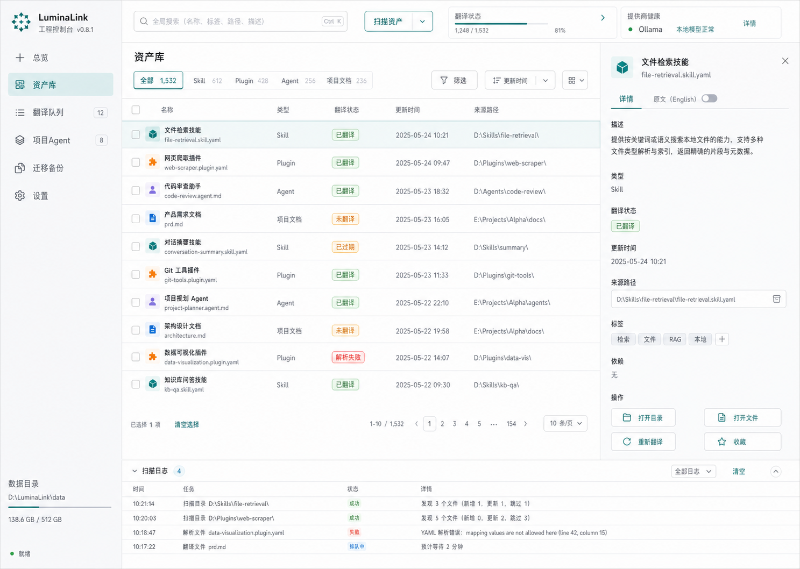
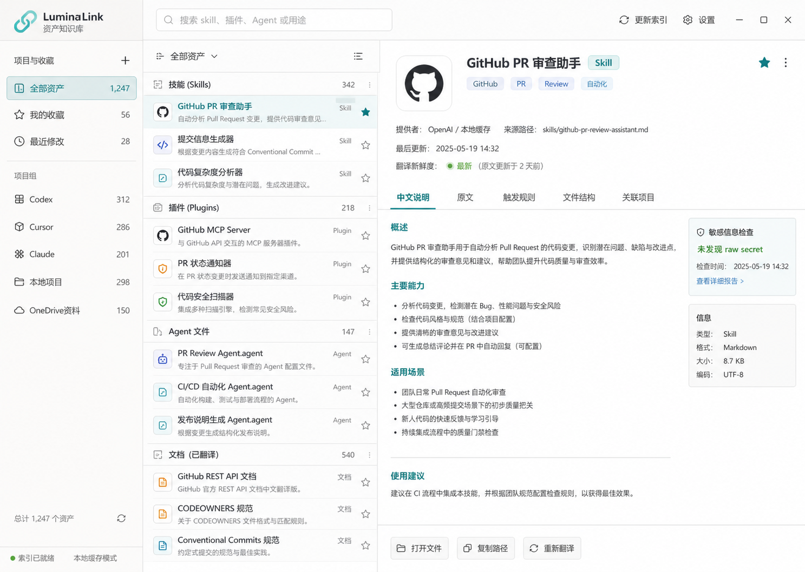
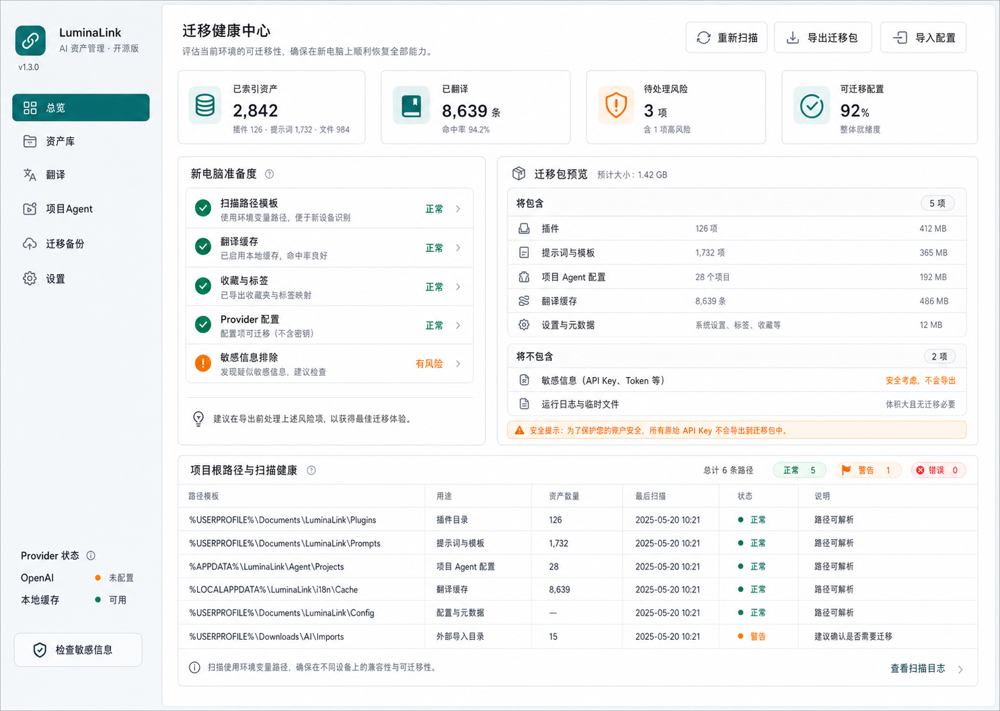

# LuminaLink UI 概念图说明

- 日期：2026-07-04
- 图片目录：`docs/ui`
- 用途：用于选择 LuminaLink 第一版桌面端视觉方向，不是最终实现稿。

## 方向 1：工程控制台

推荐用途：MVP 主界面。

特点：

- 左侧主导航清楚。
- 中间资产表格信息密度高。
- 右侧详情面板适合展示中文说明、原文、路径、标签和操作。
- 底部扫描日志能承载后台任务状态。

适合先实现，因为它最贴近“扫描资产、搜索资产、查看详情、打开文件”的第一版核心工作流。

## 方向 2：资产知识库

推荐用途：V0.2 之后的资产阅读体验。

特点：

- 更强调“理解某个 skill/plugin 能做什么”。
- 中间按分类组织，右侧像文档阅读器。
- 中文说明、原文、触发规则、文件结构、关联项目可以分 tab 展示。
- 适合做长期资料库和收藏夹。

适合在翻译缓存稳定后增强，因为它对文案质量和结构化解析要求更高。

## 方向 3：迁移健康中心

推荐用途：迁移与备份页面。

特点：

- 最能体现“换电脑也能用”的差异化。
- 通过检查清单说明哪些配置可迁移、哪些不能导出。
- 明确展示 raw API key / token 不会导出。
- 用环境变量路径表达跨电脑兼容性。

适合作为 V0.4 的核心页面，也可以在 MVP 总览页里抽取部分健康指标。

## 建议组合

第一版建议采用：

- 主界面：方向 1
- 详情阅读：吸收方向 2 的 tab 结构
- 迁移页面：采用方向 3

这样能避免第一版做得过散，同时保留产品长期特色。

## 后续实现备注

- 真实前端实现时不要依赖图片里的文字细节，图片只作为布局和视觉方向参考。
- 图中具体数字、路径和日期都是示例数据。
- 真实路径必须使用用户配置和环境变量展开，不能写死某台电脑的绝对路径。

